## 1st Capstone project
# Urban Furnishings


 
## About the project >
Welcome to Urban Furnishings, a modern e-commerce furniture store with a concept similar to IKEA. This store offers a wide range of unique and affordable furniture pieces for all kinds of spaces, from apartments to homes and offices. This README.md file serves as an introduction to my e-commerce store and outlines our key features.

- This website is mainly built using HTML and CSS and a little bit of JS
- Checkout page was built using Bootstrap
- Logo was designed and created by me

## Built With >
* HTML
* CSS
* JS
* Bootstrap

# Interesting concepts
1. button effect

**HTML CODE**

  ```html
    <a href="product.html" class="btn">Explore &#8658;</a>
  ```

**CSS CODE**
  ```css
  .btn{
    display: inline-block;
    background: #BECFF4;
    color: #555;
    padding: 8px 30px;
    margin: 30px 0;
    border-radius: 30px;
    transition: 0.5s;
}
.btn:hover{
    background: #789ef0;
}
  ```
2. User Login Page

**HTML CODE**
```html
    <div class="account-page">
        <div class="container">
            <div class="row">
                <div class="col-2">
                    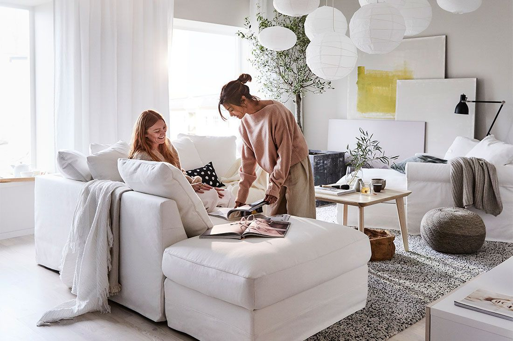
                </div>

                <div class="col-2">
                    <div class="form-container">
                        <div class="form-btn">
                            <span onclick="login()">Login</span>
                            <span onclick="register()">Register</span>
                            <hr id="indicator">
                        </div>

                        <form id="LoginForm" action="">
                            <input type="text" placeholder="Username">
                            <input type="password" placeholder="Password">
                            <button type="Submit" class="btn">Login</button>

                            <a href="">Forgot Password</a>
                            
                        </form>
                        
                        <form id="RegForm" action="">
                            <input type="text" placeholder="Username">
                            <input type="email" placeholder="email">
                            <input type="password" placeholder="Password">
                            <button type="Submit" class="btn">Register</button>
                        </form>
                    </div>
                </div>
            </div>
        </div>
    </div>
```

**CSS CODE**
```css
.account-page{
    padding: 50px 0;
    background: radial-gradient(#fff, #e7eaf1);
}
.account-page img{
    margin-top: 60px;
    width: 100%;
}
.form-container{
    background: #fff;
    width: 300px;
    height: 400px;
    position: relative;
    text-align: center;
    padding: 20px 0;
    margin: auto;
    box-shadow: 0 0 20px 0px rgba(0,0,0,0.1);
    overflow-y: hidden;
}
.form-container span{
    font-weight: bold;
    padding: 0 10px;
    color: #555;
    cursor: pointer;
    width: 100px;
    display: inline-block
}
.form-btn{
    display: inline-block;
}
.form-container form{
    max-width: 300px;
    padding: 0 20px;
    position: absolute;
    top: 130px;
    transition: transform 1s;
}
form input{
    width: 100%;
    height: 30px;
    margin: 10px 0;
    padding: 0 10px;
    border: 1px solic #ccc;
}
form .btn{
    width: 100%;
    border: none;
    cursor: pointer;
    margin: 10px 0;
}
form .btn:focus{
    outline: none
}

#LoginForm{
    left: -300px;
}
#RegForm{
    left: 0;
}
form a{
    font-size: 12px;
}
#indicator{
    width: 100px;
    border: none;
    background: #789ef0;
    height: 3px;
    margin-top: 8px;
    transform: translateX(100px);
    transition: transform 1s;
}
```
# Screenshots of website
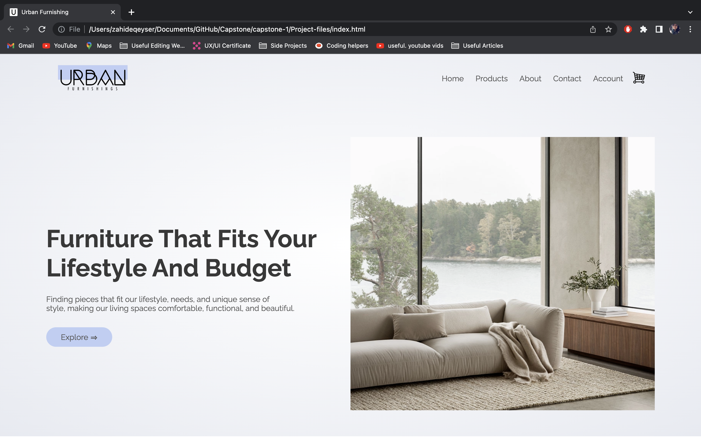
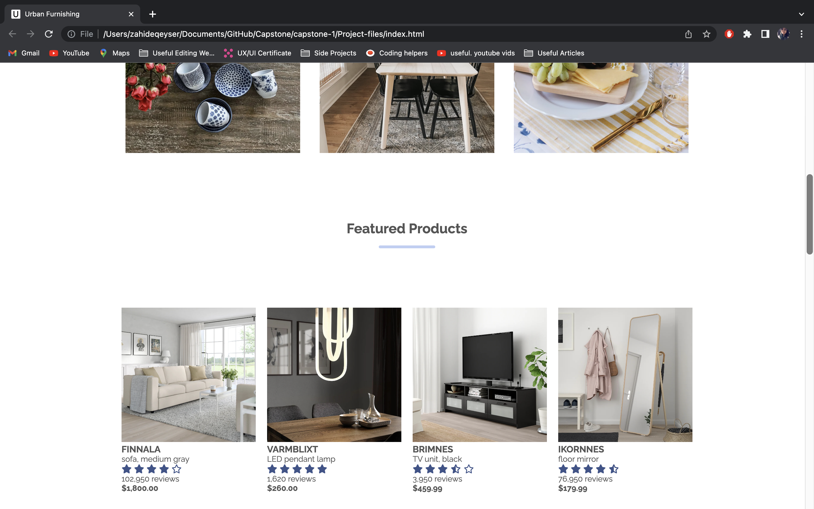
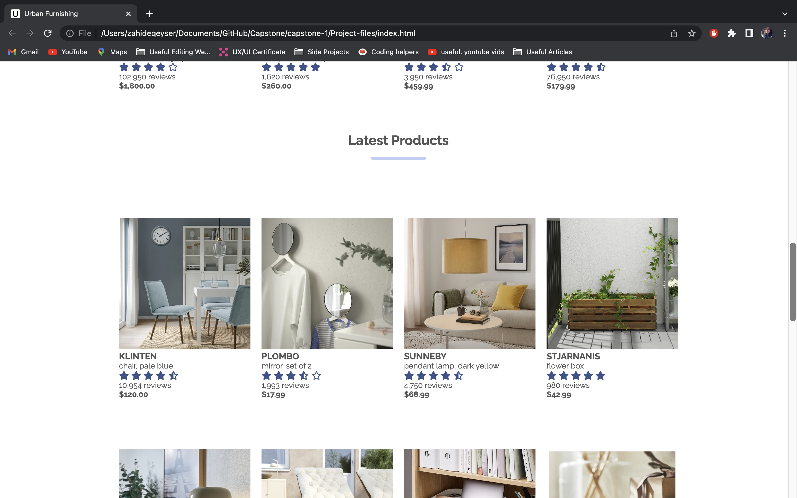
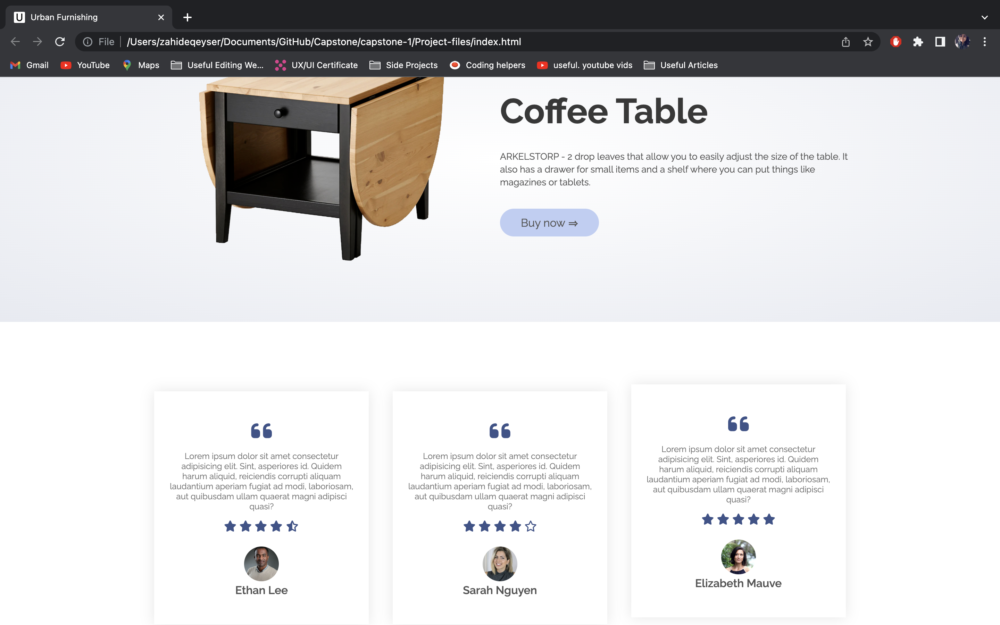
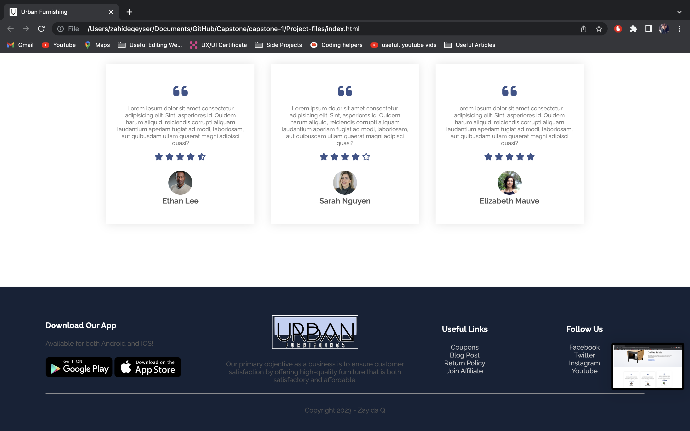
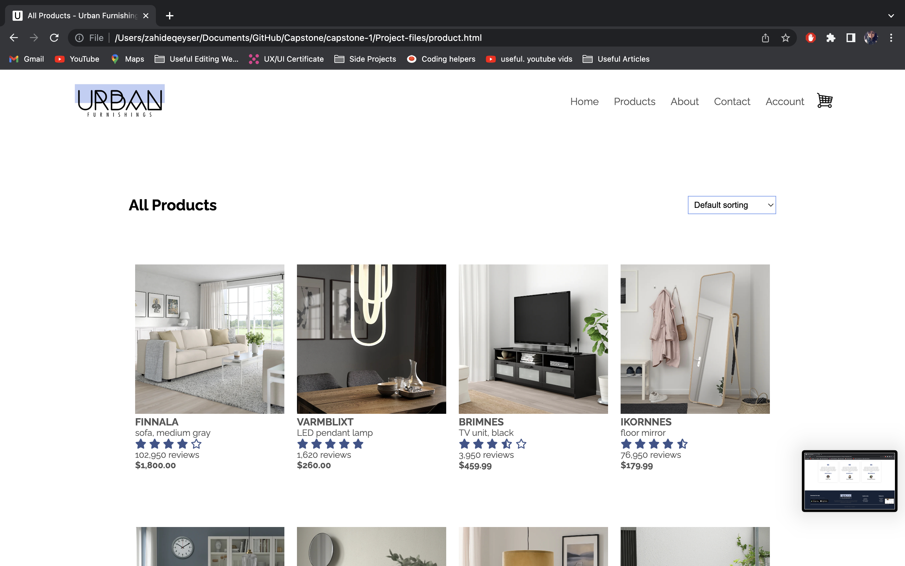
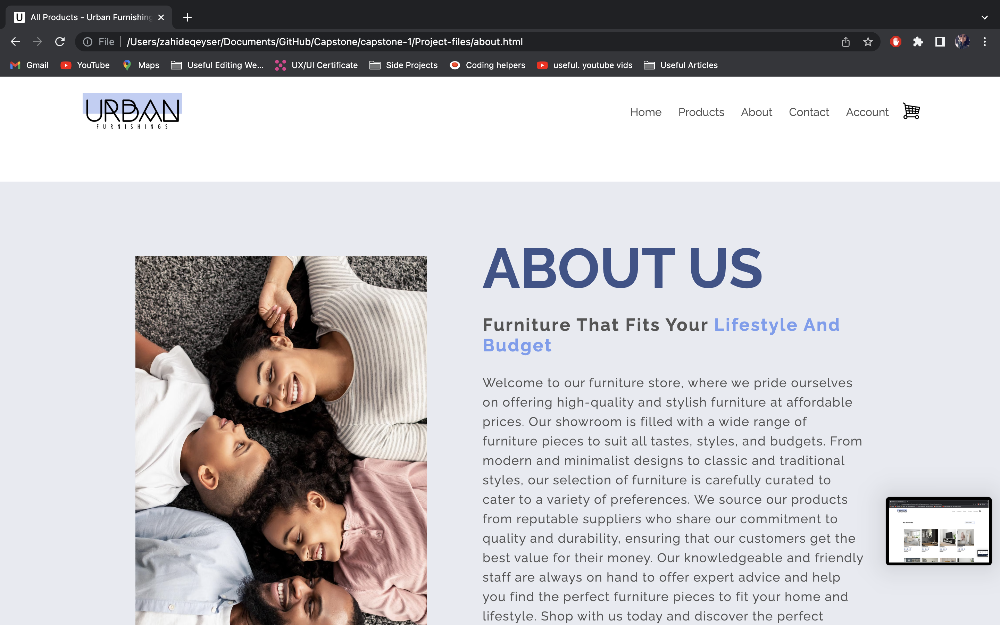
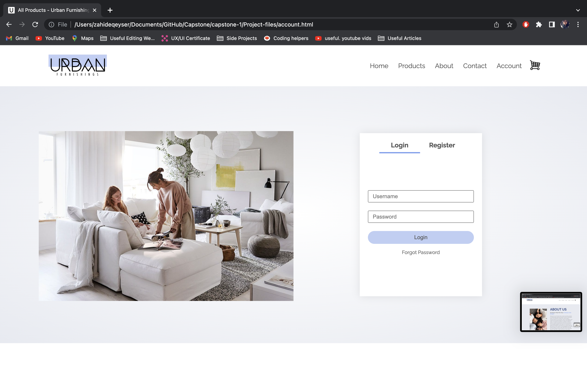
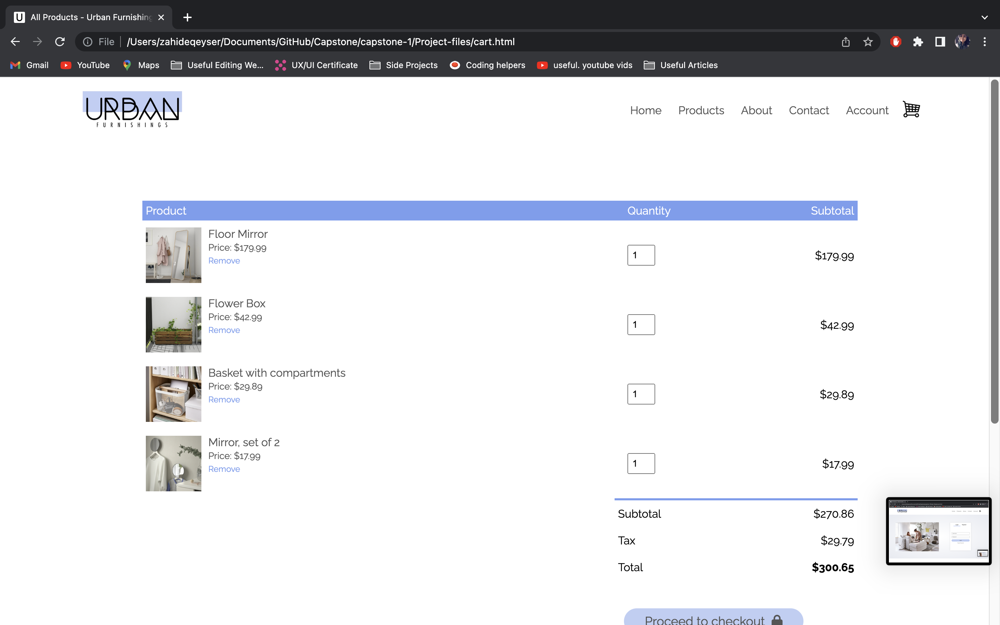
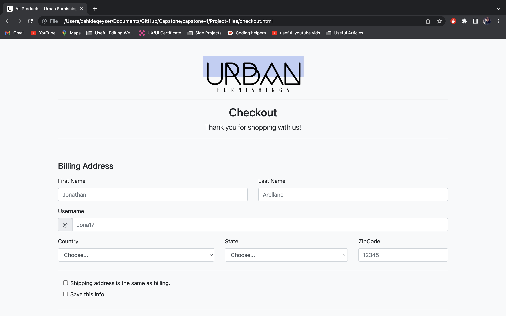

